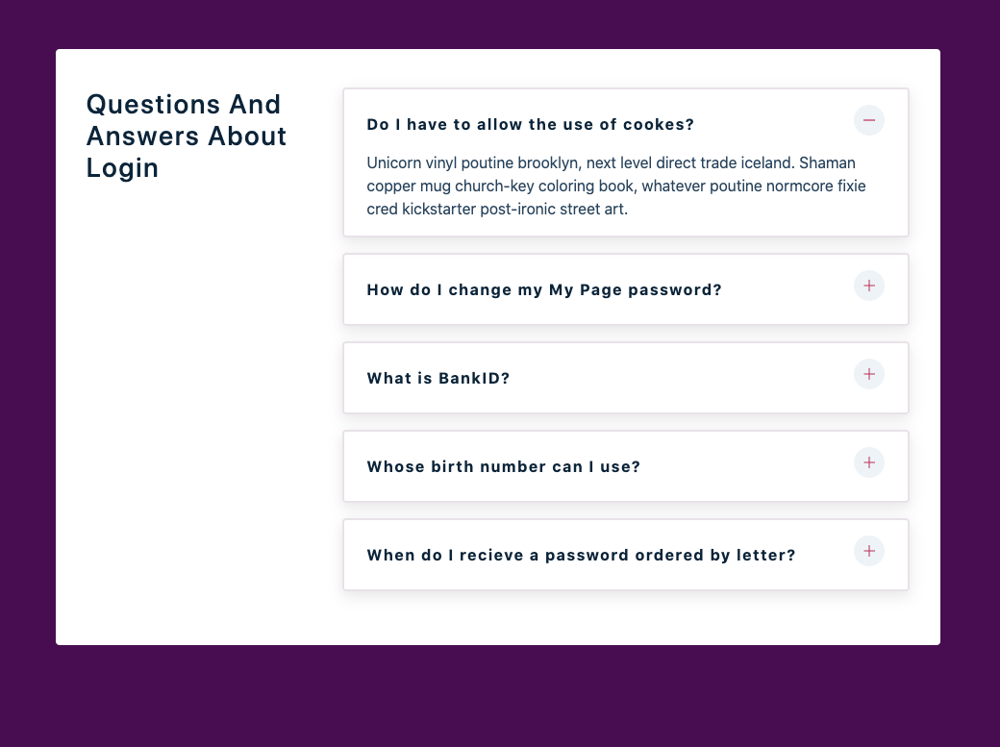

# A FAQ example page"

[Link to live project!](https://mwomack-react-questions-4.netlify.app/)

### This is a React component utilizing:

- useState
- conditional rendering
- responsive UI
- react icons

