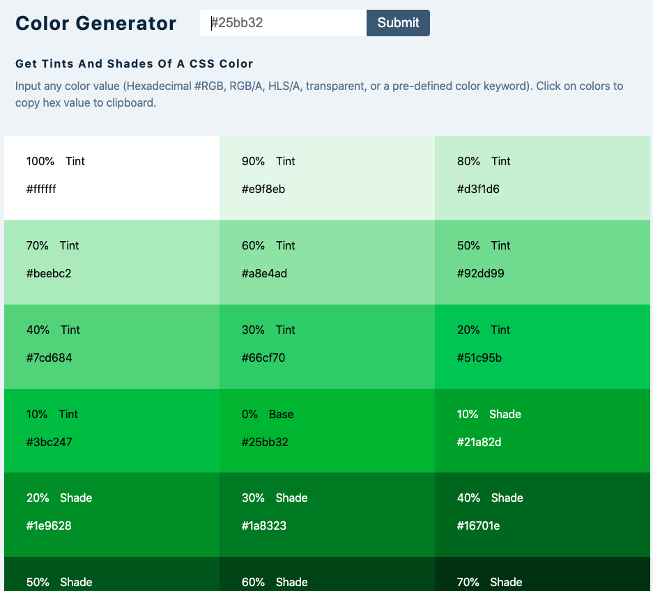

# A color generator app"

### Get tints and shades of a CSS color

[Link to live project!](https://mwomack-react-9-colors.netlify.app/)

### This is a React component utilizing:

- [Values.js](https://github.com/noeldelgado/values.js)
- useState, useEffect
- conditional rendering
- responsive UI

